# predictive-donor-pipeline

## CharityML: Finding Donors for Charity

> **Udacity Machine Learning with PyTorch Nanodegree — Project 1**  
> Binary income classification using supervised machine learning to identify prospective charitable donors from 1994 U.S. Census data.


---

## Table of Contents

1. [Project Overview](#-project-overview)
2. [Problem Statement](#-problem-statement)
3. [Dataset](#-dataset)
4. [Architecture](#-architecture)
5. [Preprocessing Pipeline](#-preprocessing-pipeline)
6. [Models Evaluated](#-models-evaluated)
7. [Results](#-results)
8. [Feature Importance](#-feature-importance)
9. [Kaggle Competition](#-kaggle-competition)
10. [Value Statement](#-value-statement)
11. [Limitations](#-limitations)
12. [Future Research](#-future-research)
13. [Installation & Usage](#-installation--usage)
14. [Project Structure](#-project-structure)
15. [References](#-references)

---

## Project Overview

CharityML is a fictitious non-profit organisation that relies on direct mail campaigns to solicit donations. Research shows individuals earning **more than $50,000 annually** are the demographic most likely to donate. Mailing all census records indiscriminately is expensive — the goal is to build a precision-focused machine learning classifier that identifies the right people.

This project evaluates **four supervised learning algorithms** across a structured pipeline, selects the best performer (XGBoost), applies hyperparameter tuning, and generates a Kaggle competition submission — achieving an **F-0.5 score of 0.7507** and **86.99% accuracy**, representing a **2.57× improvement** over the naive predictor baseline.

| Metric | Naive Predictor | Best Model (XGBoost Tuned) | Improvement |
|--------|:-:|:-:|:-:|
| Accuracy | 0.2478 | **0.8699** | +0.6221 |
| F-0.5 Score | 0.2917 | **0.7507** | **+0.4590 (2.57×)** |

---

## Problem Statement

The task is a **supervised binary classification** problem:

> Given 13 demographic and socioeconomic features extracted from 1994 U.S. Census records, predict whether an individual earns **more than $50,000** annually (`>50K = 1`) or **at most $50,000** (`<=50K = 0`).

**Key challenges:**

- **Class imbalance:** Only 24.78% of records fall in the positive (>$50K) class
- **Heterogeneous features:** Mix of continuous numeric and high-cardinality categorical variables
- **Precision priority:** CharityML penalises false positives (mailing non-donors) more than false negatives — driving use of the **F-β score with β = 0.5**, which weights precision twice as heavily as recall
- **Generalisation:** Model must perform well on an unseen Kaggle test set containing missing values

The naive baseline (always predicting >$50K) yields accuracy ≈ 0.2478 and F-0.5 ≈ 0.2917 — the meaningful floor the model must decisively exceed.

---

## Dataset

**Source:** [UCI Machine Learning Repository — Adult (Census Income) Dataset](https://archive.ics.uci.edu/ml/datasets/adult)  
**Original contributors:** Ronny Kohavi & Barry Becker (1996), extracted from the 1994 U.S. Census Bureau database.

### Splits

| Split | Records | Features | Labels |
|-------|--------:|--------:|--------|
| Training (`census.csv`) | 45,222 | 13 | ✅ Yes |
| Test / Kaggle (`test_census.csv`) | 45,222 | 13 | ❌ No |

### Feature Descriptions

| Feature | Type | Description |
|---------|------|-------------|
| `age` | Continuous | Age of individual |
| `workclass` | Categorical | Employment sector (Private, Gov, Self-emp, etc.) |
| `education_level` | Categorical | Highest education attained |
| `education-num` | Continuous | Numeric proxy for education level |
| `marital-status` | Categorical | Marital status (7 categories) |
| `occupation` | Categorical | Job type (14 categories) |
| `relationship` | Categorical | Family relationship role |
| `race` | Categorical | Race (5 categories) |
| `sex` | Categorical | Sex (Male / Female) |
| `capital-gain` | Continuous | Investment capital gains (heavily right-skewed) |
| `capital-loss` | Continuous | Investment capital losses (heavily right-skewed) |
| `hours-per-week` | Continuous | Hours worked per week |
| `native-country` | Categorical | Country of origin (41 categories) |
| `income` *(target)* | Binary | `>50K` or `<=50K` |

### Key Statistics

| Characteristic | Detail |
|---|---|
| Class distribution | 75.22% ≤$50K · 24.78% >$50K |
| Skewed features | `capital-gain`, `capital-loss` (log-transformed) |
| Highest cardinality | `native-country` (41 unique values) |
| Missing values — train | None |
| Missing values — test | 13–22 per column (imputed) |
| Features after encoding | **103** (one-hot expanded) |

---

## Architecture

### Data Science Flow

```mermaid
flowchart TD
    %% ── Node styles ────────────────────────────────────────────────────────
    classDef data        fill:#1E3A5F,stroke:#4A90D9,stroke-width:2px,color:#FFFFFF,font-weight:bold
    classDef eda         fill:#5B2D8E,stroke:#9B6DD6,stroke-width:2px,color:#FFFFFF,font-weight:bold
    classDef preproc     fill:#0D6E6E,stroke:#2EC4B6,stroke-width:2px,color:#FFFFFF,font-weight:bold
    classDef split       fill:#7A4100,stroke:#F4A261,stroke-width:2px,color:#FFFFFF,font-weight:bold
    classDef models      fill:#1A4731,stroke:#52B788,stroke-width:2px,color:#FFFFFF,font-weight:bold
    classDef selection   fill:#6B1A1A,stroke:#E63946,stroke-width:2px,color:#FFFFFF,font-weight:bold
    classDef tuning      fill:#004080,stroke:#4FC3F7,stroke-width:2px,color:#FFFFFF,font-weight:bold
    classDef output      fill:#3D0066,stroke:#CE93D8,stroke-width:2px,color:#FFFFFF,font-weight:bold
    classDef kaggle      fill:#005C3E,stroke:#00E676,stroke-width:2px,color:#FFFFFF,font-weight:bold
    classDef metric      fill:#4A3000,stroke:#FFB300,stroke-width:2px,color:#FFFFFF,font-weight:bold

    %% ── Stage 0 : Raw Data ─────────────────────────────────────────────────
    subgraph S0["📦  DATA INGESTION"]
        direction TB
        A1["census.csv\n45,222 rows · 13 features\nLabelled training data"]:::data
        A2["test_census.csv\n45,222 rows · 13 features\nUnlabelled · missing values"]:::data
    end

    %% ── Stage 1 : EDA ──────────────────────────────────────────────────────
    subgraph S1["🔬  EXPLORATORY DATA ANALYSIS"]
        direction TB
        B1["Class Balance Check\n75.22% ≤$50K · 24.78% >$50K"]:::eda
        B2["Distribution Analysis\ncapital-gain & capital-loss\nidentified as right-skewed"]:::eda
        B3["Naive Predictor Baseline\nAccuracy: 0.2478 · F-0.5: 0.2917"]:::eda
    end

    %% ── Stage 2 : Preprocessing ────────────────────────────────────────────
    subgraph S2["⚙️  PREPROCESSING PIPELINE"]
        direction TB
        C1["Missing Value Imputation\n(test set only)\nNumeric → median\nCategorical → mode"]:::preproc
        C2["Log Transform\nlog1p(capital-gain)\nlog1p(capital-loss)"]:::preproc
        C3["MinMax Scaling\nFit on X_train only\nTransform train + test"]:::preproc
        C4["One-Hot Encoding\npd.get_dummies()\n13 → 103 features"]:::preproc
        C5["Label Encoding\n>50K → 1 · ≤50K → 0"]:::preproc
        C1 --> C2 --> C3 --> C4 --> C5
    end

    %% ── Stage 3 : Split ────────────────────────────────────────────────────
    subgraph S3["✂️  TRAIN / TEST SPLIT"]
        direction LR
        D1["X_train · y_train\n36,177 samples (80%)"]:::split
        D2["X_test · y_test\n9,045 samples (20%)\nrandom_state = 0"]:::split
    end

    %% ── Stage 4 : Model Benchmarking ───────────────────────────────────────
    subgraph S4["🤖  MODEL BENCHMARKING  (1% · 10% · 100% data)"]
        direction TB
        E1["Logistic Regression\nLinear baseline\nF-0.5: 0.6826"]:::models
        E2["Random Forest\nBagged ensemble · 100 trees\nF-0.5: 0.6813"]:::models
        E3["AdaBoost\nBoosted stumps · sequential\nF-0.5: 0.7029"]:::models
        E4["XGBoost ⭐\nGradient boosting + L1/L2 reg\nF-0.5: 0.7498"]:::models
    end

    %% ── Stage 5 : Model Selection ──────────────────────────────────────────
    subgraph S5["🏆  MODEL SELECTION"]
        F1["Evaluation Metric\nF-0.5 Score · Accuracy\nTrain time · Pred time"]:::selection
        F2["Winner: XGBoost\nBest F-0.5 at all\ndata size checkpoints"]:::selection
        F1 --> F2
    end

    %% ── Stage 6 : Hyperparameter Tuning ────────────────────────────────────
    subgraph S6["🔧  HYPERPARAMETER TUNING"]
        direction TB
        G1["GridSearchCV\n5-fold cross-validation\n27 parameter combinations"]:::tuning
        G2["Search Space\nn_estimators: 100·200·300\nlearning_rate: 0.05·0.1·0.2\nmax_depth: 3·5·7"]:::tuning
        G3["Best Config ✅\nlearning_rate = 0.2\nmax_depth = 3\nn_estimators = 200"]:::tuning
        G1 --> G2 --> G3
    end

    %% ── Stage 7 : Metrics ──────────────────────────────────────────────────
    subgraph S7["📈  FINAL EVALUATION"]
        direction LR
        H1["Accuracy\n0.8699"]:::metric
        H2["F-0.5 Score\n0.7507"]:::metric
        H3["CV F-0.5\n0.7579"]:::metric
    end

    %% ── Stage 8 : Feature Importance ───────────────────────────────────────
    subgraph S8["🔍  FEATURE IMPORTANCE"]
        direction TB
        I1["Top 5 Features\n1. capital-gain\n2. age\n3. capital-loss\n4. education-num\n5. hours-per-week"]:::output
        I2["Reduced Model Test\n5 features only\nPerformance vs. full set\ncomparison"]:::output
    end

    %% ── Stage 9 : Kaggle Submission ────────────────────────────────────────
    subgraph S9["🏅  KAGGLE SUBMISSION"]
        direction TB
        J1["Apply Full Pipeline\nto test_census.csv\n45,222 records"]:::kaggle
        J2["Predictions\n20.59% predicted >$50K\n9,313 high-income\n35,909 low-income"]:::kaggle
        J3["kaggle_submission.csv\nFormat: id · income\nReady to upload"]:::kaggle
        J1 --> J2 --> J3
    end

    %% ── Edges ──────────────────────────────────────────────────────────────
    A1 --> S1
    A2 --> C1

    S1 --> S2
    C5 --> S3

    D1 --> S4
    D2 --> S4

    S4 --> S5
    F2 --> S6
    G3 --> S7
    G3 --> S8
    G3 --> S9
```



### XGBoost Internal Architecture

XGBoost (Extreme Gradient Boosting) builds a sequential ensemble of shallow **CART trees**, each fitted to the **negative gradient** (pseudo-residuals) of the loss from all prior trees. It uses a **second-order Taylor expansion** of the loss for more precise optimisation than standard gradient boosting (Chen & Guestrin, 2016).

Key architectural advantages over AdaBoost and Random Forest:

| Feature | Random Forest | AdaBoost | **XGBoost** |
|---|:-:|:-:|:-:|
| Ensemble type | Bagging | Boosting (sample weights) | Boosting (gradient residuals) |
| L1 / L2 regularisation | ❌ | ❌ | ✅ |
| 2nd-order gradient optimisation | ❌ | ❌ | ✅ |
| Built-in missing value handling | ❌ | ❌ | ✅ |
| Gain-based feature importance | Partial | ❌ | ✅ |
| Parallel tree construction | ✅ | ❌ | ✅ |

The optimal **max_depth = 3** (shallow trees) and **learning_rate = 0.2** indicate the census data benefits from many conservative boosting steps rather than deep trees that risk overfitting the 103-dimensional one-hot encoded feature space.

---

## Preprocessing Pipeline

All preprocessing steps are applied in a fixed order to **prevent data leakage** — the `MinMaxScaler` is fitted exclusively on training data before transforming both train and test sets.

```
Raw Data
   │
   ├─ [Test set only] Missing Value Imputation
   │       Numeric columns  → fill with column median
   │       Categorical cols → fill with column mode
   │
   ├─ Log Transform (skewed features)
   │       capital-gain  → log1p(capital-gain)
   │       capital-loss  → log1p(capital-loss)
   │
   ├─ MinMax Scaling (numeric features)
   │       Fitted on X_train, applied to X_train + X_test
   │       Features: age, education-num, capital-gain,
   │                 capital-loss, hours-per-week → [0, 1]
   │
   ├─ One-Hot Encoding
   │       pd.get_dummies() on all categorical features
   │       13 raw features → 103 binary/numeric features
   │       Test set reindexed to match train columns (fill=0)
   │
   └─ Label Encoding (target only)
           >50K  → 1
           ≤50K  → 0
```

---

## 🤖 Models Evaluated

### 1. Logistic Regression *(Linear Baseline)*
- **Library:** `sklearn.linear_model.LogisticRegression`
- **Config:** `max_iter=1000, random_state=42`
- **Why chosen:** Fast, interpretable, well-suited to normalised one-hot encoded inputs; establishes whether the problem is approximately linearly separable.

### 2. Random Forest *(Bagged Ensemble)*
- **Library:** `sklearn.ensemble.RandomForestClassifier`
- **Config:** `n_estimators=100, random_state=42`
- **Why chosen:** Handles mixed numeric/categorical space well; provides baseline ensemble performance; exposes `feature_importances_`.

### 3. AdaBoost *(Sequential Boosting)*
- **Library:** `sklearn.ensemble.AdaBoostClassifier`
- **Config:** `random_state=42` (default 50 stumps)
- **Why chosen:** Well-suited to binary classification with class imbalance; focuses successive trees on misclassified samples.

### 4. XGBoost *(Gradient Boosted Trees — Selected Model)* ⭐
- **Library:** `xgboost.XGBClassifier`
- **Config:** `n_estimators=200, learning_rate=0.2, max_depth=3, eval_metric='logloss', random_state=42`
- **Why chosen:** Combines L1/L2 regularisation, second-order gradient optimisation, and parallelised tree construction — consistently top performer on structured tabular Kaggle datasets (Chen & Guestrin, 2016; Nielsen, 2016).

---

## Results

### Model Comparison (100% Training Data)

| Model | Train Acc. | Test Acc. | Train F-0.5 | Test F-0.5 |
|-------|:---------:|:--------:|:-----------:|:----------:|
| Naive Predictor | — | 0.2478 | — | 0.2917 |
| Logistic Regression | 0.8417 | 0.8417 | 0.6826 | 0.6826 |
| Random Forest | 0.9988 | 0.8423 | 0.9993 | 0.6813 |
| AdaBoost | 0.8792 | 0.8483 | 0.7464 | 0.7029 |
| XGBoost (untuned) | 0.9139 | 0.8694 | 0.8097 | 0.7498 |
| **XGBoost (tuned) ★** | **0.9023** | **0.8699** | **0.7917** | **0.7507** |

> ★ **Best parameters:** `learning_rate=0.2`, `max_depth=3`, `n_estimators=200`  
> **Cross-validated F-0.5:** 0.7579 (5-fold, 27-combination GridSearchCV)

### Interpretation

- **Random Forest** severely overfits (train F-0.5 = 0.9993 vs. test = 0.6813), suggesting the 103-dimensional one-hot space allows memorisation without regularisation.
- **AdaBoost** is a solid second-best at 0.7029, but XGBoost's built-in L1/L2 regularisation yields a 6.8-percentage-point F-0.5 advantage.
- **Tuning XGBoost** improves F-0.5 by +0.0009, confirming the untuned defaults were already near-optimal at `max_depth=3` — shallow trees prevent overfitting on this dataset.

---

## Feature Importance

Feature importances extracted from the tuned XGBoost model using **gain-based splitting criteria** — measuring average loss reduction per split across all trees.

| Rank | Feature | Importance | Economic Interpretation |
|:----:|---------|:----------:|------------------------|
| 1 | `capital-gain` | ⭐⭐⭐⭐⭐ | Direct evidence of investment income; near-definitive signal for >$50K |
| 2 | `age` | ⭐⭐⭐⭐ | Mid-career seniority (35–55) strongly correlated with high wages |
| 3 | `capital-loss` | ⭐⭐⭐ | Tax-loss harvesting signals high-income investor behaviour |
| 4 | `education-num` | ⭐⭐⭐ | Advanced degrees (Doctorate, Masters) linked to high-salary roles |
| 5 | `hours-per-week` | ⭐⭐ | High hours → demanding or multiple roles above $50K threshold |

### Reduced-Feature Experiment

The model was also trained on only the top 5 features. The full-feature model outperforms the reduced set by approximately 2–4% accuracy and 3–6 percentage points on F-0.5, confirming that while these five features are most important, the remaining categorical variables (occupation, relationship, marital-status one-hot dummies) contribute meaningful cumulative signal.

---

## Kaggle Competition

**Competition:** [Udacity mlcharity-competition on Kaggle](https://www.kaggle.com/c/udacity-mlcharity-competition)

### Test Set Preprocessing (Additional Steps)

The Kaggle test set (`test_census.csv`) contains 13–22 missing values per column, requiring additional imputation before applying the standard pipeline:

```python
# Numeric columns → median imputation (robust to outliers)
for col in numerical_cols:
    test_data[col].fillna(test_data[col].median(), inplace=True)

# Categorical columns → mode imputation (most frequent value)
for col in categorical_cols:
    test_data[col].fillna(test_data[col].mode()[0], inplace=True)
```

After imputation, the same log-transform → MinMax scale → one-hot encode → column-align pipeline is applied. The test DataFrame is `reindex`-ed to exactly match the 103 training columns, filling any absent dummy columns with 0.

### Submission Results

| Metric | Value |
|--------|-------|
| Total predictions | 45,222 |
| Predicted >$50K | 9,313 (20.59%) |
| Predicted ≤$50K | 35,909 (79.41%) |
| Expected >$50K in training | 24.78% |
| Output file | `kaggle_submission.csv` |

The 20.59% prediction rate (vs. 24.78% in training) is expected — imputation of missing values in the test set introduces slight regression toward the mean, reducing predicted high-income prevalence modestly.

---

## Value Statement

The business impact of this model extends far beyond accuracy metrics:

**Direct cost savings:** In a typical direct mail campaign costing $2–5 per recipient, the model reduces the target pool from 45,222 to ~9,313 individuals — generating estimated savings of **$70,000–$180,000 per campaign cycle** while simultaneously increasing the donor hit rate.

**Strategic insights:** The top feature importances reveal that capital gains, age, and education level are the primary income predictors. This enables CharityML to:
- Time campaigns around **capital gains tax events**
- Design **age-segmented messaging** for 35–55 demographics
- Prioritise **education-level data collection** in future surveys

**Scalability:** The pipeline can be retrained annually as new census data becomes available, with minimal engineering overhead. The modular preprocessing functions and saved `MinMaxScaler` ensure consistent inference on new records.

---

## Limitations

| Limitation | Description |
|---|---|
| **Data currency** | Dataset is from 1994 (30+ years old); income distributions and workforce composition have changed substantially |
| **Class imbalance** | No SMOTE or `scale_pos_weight` applied; the 75/25 split may still bias predictions |
| **Fairness / bias** | Sensitive features (race, sex, native-country) included without fairness auditing; model may encode historical socioeconomic biases |
| **Hyperparameter scope** | GridSearchCV covered only 27 combinations; wider Bayesian search over `subsample`, `colsample_bytree`, `min_child_weight` may further improve results |
| **Imputation quality** | Simple median/mode imputation applied to test set; KNNImputer or IterativeImputer could reduce bias |

---

## Future Research

- **Tabular deep learning:** Compare TabNet (Arik & Pfister, 2021) and FT-Transformer (Gorishniy et al., 2021) against XGBoost on this dataset
- **Stacked ensembles:** Use XGBoost, Random Forest, and AdaBoost predictions as meta-features for a Logistic Regression meta-learner (Wolpert, 1992)
- **Fairness-aware classification:** Apply disparate impact analysis and post-processing calibration across race, sex, and national origin subgroups (Barocas et al., 2019)
- **Updated data:** Retrain on American Community Survey (ACS) 2020–2024 microdata for contemporary applicability
- **SHAP explainability:** Integrate SHapley Additive exPlanations (Lundberg & Lee, 2017) for individual-level donor explanation and stakeholder trust

---

## Installation & Usage

### Prerequisites

```bash
Python 3.10+
```

### Install Dependencies

```bash
pip install scikit-learn pandas numpy matplotlib seaborn xgboost jupyter
```

### Run the Notebook

```bash
# 1. Unzip the starter package (if not already done)
unzip starter.zip && cd starter

# 2. Confirm required files are present
ls census.csv test_census.csv visuals.py

# 3. Launch Jupyter
jupyter notebook finding_donors.ipynb

# 4. Run all cells
#    Kernel → Restart & Run All

# 5. Outputs generated:
#    - finding_donors.ipynb (executed with all outputs)
#    - kaggle_submission.csv (ready to upload)
```

### Run Headlessly (CI / Validation)

```bash
jupyter nbconvert --to notebook --execute finding_donors.ipynb \
    --output finding_donors_executed.ipynb \
    --ExecutePreprocessor.timeout=600
```

### Expected Outputs

| File | Description |
|------|-------------|
| `finding_donors.ipynb` | Executed notebook with all cell outputs |
| `kaggle_submission.csv` | 45,222-row Kaggle submission (`id, income`) |
| `CharityML_Report.docx` | Full project report (Word format) |

---

## Project Structure

```
charityml-finding-donors/
│
├── finding_donors.ipynb      # Main Jupyter notebook (all TODOs completed)
├── visuals.py                # Helper visualisation module (provided)
├── census.csv                # Labelled training data (45,222 rows)
├── test_census.csv           # Unlabelled Kaggle test data (45,222 rows)
├── example_submission.csv    # Sample submission format
│
├── kaggle_submission.csv     # ✅ Generated Kaggle submission
├── CharityML_Report.docx     # ✅ Comprehensive project report
├── README.md                 # ✅ This file
│
└── requirements.txt          # (optional) pip freeze of environment
```

---

## References

Arik, S. O., & Pfister, T. (2021). TabNet: Attentive interpretable tabular learning. *AAAI Conference on Artificial Intelligence, 35*(8), 6679–6687. https://doi.org/10.1609/aaai.v35i8.16826

Barocas, S., Hardt, M., & Narayanan, A. (2019). *Fairness and machine learning: Limitations and opportunities.* fairmlbook.org. https://fairmlbook.org

Breiman, L. (2001). Random forests. *Machine Learning, 45*(1), 5–32. https://doi.org/10.1023/A:1010933404324

Chen, T., & Guestrin, C. (2016). XGBoost: A scalable tree boosting system. *Proceedings of the 22nd ACM SIGKDD International Conference on Knowledge Discovery and Data Mining (KDD '16)*, 785–794. https://doi.org/10.1145/2939672.2939785

Dua, D., & Graff, C. (2019). *UCI Machine Learning Repository: Adult Data Set.* University of California, Irvine. https://archive.ics.uci.edu/ml/datasets/adult

Freund, Y., & Schapire, R. E. (1997). A decision-theoretic generalization of on-line learning and an application to boosting. *Journal of Computer and System Sciences, 55*(1), 119–139. https://doi.org/10.1006/jcss.1997.1997.1504

Gorishniy, Y., Rubachev, I., Khrulkov, V., & Babenko, A. (2021). Revisiting deep learning models for tabular data. *Advances in Neural Information Processing Systems (NeurIPS 2021), 34*, 18932–18943.

Kohavi, R. (1996). Scaling up the accuracy of naive-bayes classifiers: A decision-tree hybrid. *Proceedings of the Second International Conference on Knowledge Discovery and Data Mining (KDD '96)*, 202–207.

Lundberg, S. M., & Lee, S.-I. (2017). A unified approach to interpreting model predictions. *Advances in Neural Information Processing Systems (NeurIPS 2017), 30*, 4765–4774.

Nielsen, D. (2016). *Tree boosting with XGBoost — Why does XGBoost win 'every' machine learning competition?* [Master's thesis]. Norwegian University of Science and Technology. https://ntnuopen.ntnu.no/ntnu-xmlui/handle/11250/2433761

Pedregosa, F., Varoquaux, G., Gramfort, A., et al. (2011). Scikit-learn: Machine learning in Python. *Journal of Machine Learning Research, 12*, 2825–2830. https://jmlr.org/papers/v12/pedregosa11a.html

Wolpert, D. H. (1992). Stacked generalization. *Neural Networks, 5*(2), 241–259. https://doi.org/10.1016/S0893-6080(05)80023-1

---

<div align="center">

**Udacity Machine Learning with PyTorch Nanodegree · June 2026**

*Built with scikit-learn · XGBoost · Jupyter · Python 3.10*

</div>
